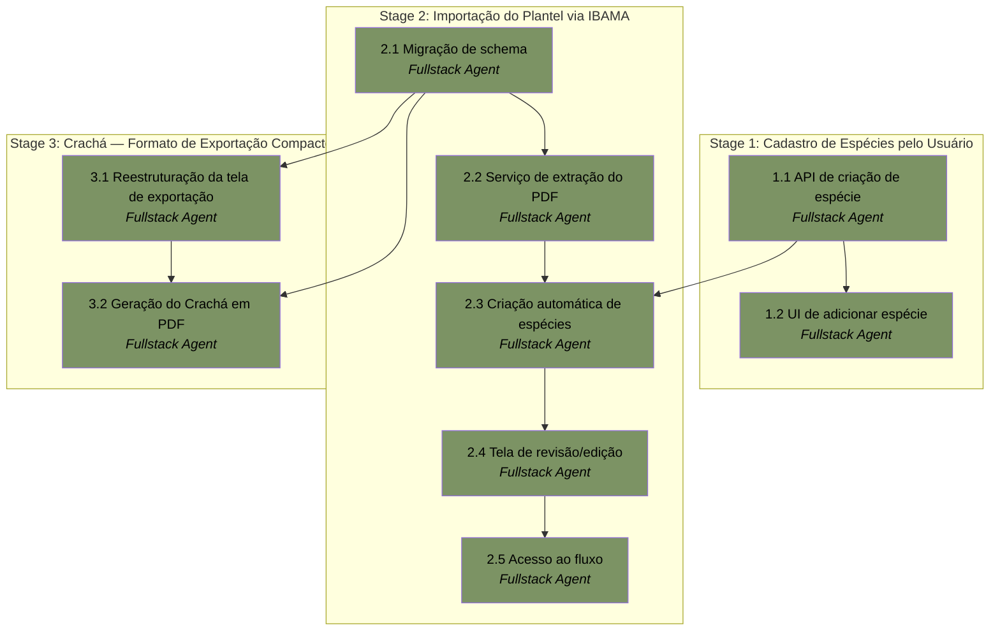

# APM Plan

## Workers

| Worker | Domain | Description |
|---|---|---|
| Fullstack Agent | Aplicação completa (frontend, backend, dados, testes, deploy) | Implementa todas as camadas da aplicação Next.js — modelo de dados/Prisma, APIs, telas de acordo com o design aprovado em `design/`, lógica de negócio, testes automatizados e deploy em produção. Mesmo Worker da Fase 1, confirmado pelo usuário como ainda suficiente. |

## Stages

| Stage | Name | Tasks | Agents |
|---|---|---|---|
| 1 | Cadastro de Espécies pelo Usuário | 2 | Fullstack Agent |
| 2 | Importação do Plantel via IBAMA | 5 | Fullstack Agent |
| 3 | Crachá — Formato de Exportação Compacto | 2 | Fullstack Agent |

## Dependency Graph

---

> **Notes:** Ciclo de planejamento incremental sobre o produto já em produção (Fase 1 completa, ver `.apm/memory/index.md` e `.apm/session-summary.md`). Único Worker novamente — despacho sequencial, sem paralelismo entre agentes. As Tasks 3.1 e 3.2 (Stage 3) dependem diretamente da Task 2.1 (Stage 2), não apenas por convenção de sequência de Stage — os campos de schema adicionados na 2.1 (`registro`, `telefone`) são conteúdo real do Crachá. Task 2.2 deve usar um PDF sintético como fixture de teste, nunca `docs/relação de aves.pdf` (contém dados pessoais reais, per nota do Spec). O mesmo revisor externo da Fase 1 fará a aceitação desta fase e precisa das três funcionalidades em produção para testar.

## Stage 1: Cadastro de Espécies pelo Usuário

### Task 1.1: API de criação de espécie com normalização e checagem de duplicata - Fullstack Agent

* **Objective:** Implementar a criação de espécies no catálogo compartilhado, com normalização de nome e prevenção de duplicatas.
* **Output:** Endpoint de criação de espécie (normaliza capitalização, verifica duplicata case-insensitive antes de criar, reaproveitando entrada existente se equivalente); endpoint de listagem atualizado para retornar sempre em ordem alfabética; a lógica de normalização/verificação de duplicata exposta como função reutilizável.
* **Validation:** Testes automatizados cobrindo: capitalização correta (ex: "canário belga" → "Canário Belga"), detecção de duplicata por variação de grafia/caixa, e ordenação alfabética da listagem.
* **Guidance:** Per Spec §Pedido A. A função de normalização/dedup deve ser reutilizável pela Task 2.3 (criação automática de espécies durante a importação) — não duplicar a lógica.
* **Dependencies:** None.

1. Implementar a função de normalização de nome (capitalização) e verificação de duplicata case-insensitive.
2. Implementar o endpoint de criação de espécie usando essa função.
3. Atualizar o endpoint de listagem para ordenar alfabeticamente.
4. Escrever os testes automatizados cobrindo os três pontos acima.

### Task 1.2: UI de adicionar espécie - inline e em Configurações - Fullstack Agent

* **Objective:** Implementar as duas superfícies de interface para adicionar uma espécie nova.
* **Output:** Ação "não encontrou sua espécie? adicione aqui" no fluxo de Novo Cadastro de Ave; seção de gestão do catálogo de espécies na tela de Configurações. Ambas ligadas ao endpoint da Task 1.1.
* **Validation:** Adicionar uma espécie a partir de qualquer uma das duas superfícies reflete imediatamente na lista (ordem alfabética) em ambos os locais e no dropdown de seleção de espécie.
* **Guidance:** Reaproveitar os componentes de formulário/lista já existentes do design system (Fase 1) — nenhum mockup novo foi produzido para esta funcionalidade.
* **Dependencies:** Task 1.1.

1. Implementar a ação de adicionar espécie inline no formulário de Novo Cadastro de Ave.
2. Implementar a seção de gestão do catálogo em Configurações.
3. Verificar que ambas as superfícies refletem o mesmo catálogo em tempo real.

## Stage 2: Importação do Plantel via IBAMA

### Task 2.1: Migração de schema - novos campos em Ave e Tenant - Fullstack Agent

* **Objective:** Adicionar os campos novos necessários para a importação e para o Crachá.
* **Output:** Migração Prisma adicionando `nomeCientifico`, `tipoAnilha`, `diametroAnilha`, `registro` (todos opcionais) em `Ave`; `telefone` (opcional) em `Tenant`. Campos expostos para edição manual onde fizer sentido (ex: `registro` na Ficha da Ave; `telefone` em Configurações).
* **Validation:** Migração executa sem erro contra o banco de produção; testes existentes da Fase 1 continuam passando; os novos campos aceitam valor nulo.
* **Guidance:** Per Spec §Mudanças de Schema. Seguir o mesmo padrão de campos opcionais já usado em `Ave` (ex: `mutacaoCor`, `foto`).
* **Dependencies:** None.

1. Atualizar `prisma/schema.prisma` com os campos novos.
2. Gerar e aplicar a migração contra o banco de produção.
3. Expor os campos novos para edição manual nas telas relevantes (Ficha da Ave para `registro`; Configurações para `telefone`).
4. Confirmar que a suíte de testes existente continua passando após a migração.

### Task 2.2: Serviço de extração do PDF do IBAMA - Fullstack Agent

* **Objective:** Implementar o serviço de extração de dados do PDF da Relação de Passeriformes.
* **Output:** Serviço que recebe um PDF e retorna: a lista de aves extraídas (mapeando as colunas do documento para os campos de `Ave`, incluindo os novos campos da Task 2.1) e uma sugestão de nome/telefone do responsável extraída da seção de identificação do documento.
* **Validation:** Testes automatizados usando um **PDF sintético** (fixture criada especificamente para o teste, reproduzindo a mesma estrutura de colunas) — nunca `docs/relação de aves.pdf`, que contém dados pessoais reais. Cobrir extração correta de cada coluna e tratamento defensivo de estrutura inesperada.
* **Guidance:** Per Spec §Pedido B — extração por posição de coluna (parsing de texto), sem OCR. O leiaute pode variar entre versões do IBAMA; a robustez desta Task não substitui a revisão manual da Task 2.4, que é a defesa principal.
* **Dependencies:** Task 2.1.

1. Implementar o parser de texto/tabela do PDF, mapeando as colunas do IBAMA para os campos de `Ave`.
2. Implementar a extração da seção de identificação do responsável (nome, telefone) do mesmo documento.
3. Criar a fixture de PDF sintético para testes.
4. Escrever os testes automatizados cobrindo extração e casos de estrutura inesperada.

### Task 2.3: Criação automática de espécies ausentes durante a importação - Fullstack Agent

* **Objective:** Ligar o serviço de extração à criação automática de espécies ausentes no catálogo.
* **Output:** Etapa do pipeline de importação que, para cada linha extraída, cria a espécie no catálogo se ausente (reaproveitando a função de normalização/dedup da Task 1.1) ou reaproveita a existente.
* **Validation:** Teste automatizado confirmando que uma espécie ausente do catálogo é criada com a normalização correta; uma espécie já existente (mesmo com grafia/caixa diferente) é reaproveitada, não duplicada.
* **Guidance:** Reaproveitar diretamente a função da Task 1.1 — não reimplementar a lógica de normalização/dedup.
* **Dependencies:** Task 2.2, Task 1.1.

1. Integrar a função de normalização/dedup da Task 1.1 ao pipeline de importação.
2. Para cada linha extraída, resolver a espécie (criar ou reaproveitar).
3. Escrever os testes cobrindo criação e reaproveitamento.

### Task 2.4: Tela de revisão/edição da importação - Fullstack Agent

* **Objective:** Implementar a tela de revisão das linhas extraídas antes da confirmação final da importação.
* **Output:** Tela mostrando todas as linhas extraídas (editáveis), com: mapeamento de sexo aplicado (M/F/I → Macho/Fêmea/Não Sexado), `origem` padrão "Adquirida", vínculo opcional de `anilhaPaiId`/`anilhaMaeId` por linha restrito a aves já existentes no banco (nunca outra linha do mesmo lote não confirmado), alerta e opção de atualizar quando a anilha já existir no tenant, e exibição da sugestão de nome/telefone do responsável com confirmação explícita antes de salvar em `Tenant`.
* **Validation:** Editar uma linha antes de confirmar persiste o valor editado, não o originalmente extraído; uma anilha duplicada exibe o alerta e só atualiza o registro existente se o usuário confirmar; os dropdowns de pai/mãe mostram apenas aves já existentes no banco; a sugestão de responsável não é salva sem confirmação explícita.
* **Guidance:** Per Spec §Pedido B. Reaproveitar a validação de compatibilidade espécie/sexo já usada na seleção de pai/mãe do cadastro manual (Fase 1, Task 2.1/2.3).
* **Dependencies:** Task 2.3.

1. Construir a tela de revisão exibindo as linhas extraídas de forma editável.
2. Implementar a detecção e o alerta de anilha duplicada com opção de atualizar.
3. Implementar os dropdowns de vínculo opcional de pai/mãe restritos a aves já existentes.
4. Implementar a exibição e confirmação da sugestão de dados do responsável.
5. Implementar a gravação final no plantel ao confirmar.

### Task 2.5: Acesso ao fluxo de importação - Onboarding e Plantel - Fullstack Agent

* **Objective:** Disponibilizar o fluxo de importação em dois pontos de entrada.
* **Output:** Passo opcional extra no Onboarding (pulável, mantendo o comportamento atual de terminar em Dashboard vazio se não usado); ação separada de importação acessível a partir da área do Plantel.
* **Validation:** Ambos os pontos de entrada levam ao mesmo fluxo (Task 2.4) e funcionam corretamente; pular a etapa no Onboarding não quebra o fluxo original da Fase 1.
* **Guidance:** Per Spec §Pedido B.
* **Dependencies:** Task 2.4.

1. Adicionar o passo opcional de importação ao fluxo de Onboarding.
2. Adicionar a ação de importação na área do Plantel.
3. Verificar que ambos os pontos de entrada levam ao mesmo fluxo.

## Stage 3: Crachá — Formato de Exportação Compacto

### Task 3.1: Reestruturação da tela de exportação - "Origem" com ação "Exportar" - Fullstack Agent

* **Objective:** Renomear a seção de exportação de "Pedigree" para "Origem" e implementar a ação única "Exportar" oferecendo Certificado e Crachá.
* **Output:** Tela/seção renomeada; ação "Exportar" apresentando a escolha entre "Certificado" (comportamento inalterado da Fase 1) e "Crachá" (novo, implementado na Task 3.2).
* **Validation:** A navegação exibe "Origem" em vez de "Pedigree"; a ação "Exportar" oferece as duas opções; selecionar "Certificado" produz exatamente o mesmo resultado da Fase 1 (teste de regressão).
* **Guidance:** Per Spec §Pedido C. Reaproveitar os componentes de navegação/ação já existentes do design system.
* **Dependencies:** Task 2.1.

1. Renomear a seção/label de "Pedigree" para "Origem" na navegação e na tela.
2. Implementar a ação "Exportar" com a escolha entre Certificado e Crachá.
3. Verificar que o caminho do Certificado permanece inalterado (regressão).

### Task 3.2: Geração do Crachá em PDF - Fullstack Agent

* **Objective:** Implementar o template do Crachá, um cartão compacto de 10x6cm.
* **Output:** Template PDF do Crachá (10x6cm) contendo: foto, nome, anilha, espécie, nascimento, sexo, `registro`, e dados do responsável (nome, telefone) — reaproveitando o serviço de árvore de 3 gerações e a infraestrutura de geração de PDF já existentes (Fase 1). Estilo segue o Design System do Ninhal, não a referência externa.
* **Validation:** Teste estrutural confirmando que o PDF gerado contém todas as seções/campos esperados para um conjunto de dados de teste; verificação visual de que o estilo usa os tokens do Design System do Ninhal, não da referência externa.
* **Guidance:** Per Spec §Pedido C. Não introduzir nova lógica de construção de árvore — reutilizar `lib/arvore/service.ts` e a infraestrutura de `lib/pedigree/` já existentes.
* **Dependencies:** Task 3.1, Task 2.1.

1. Implementar o template de PDF do Crachá no tamanho 10x6cm.
2. Integrar o serviço de árvore de 3 gerações já existente como fonte dos dados genealógicos.
3. Integrar os campos novos (`registro`, `telefone`) e os já existentes (foto, nome, anilha, espécie, nascimento, sexo) ao template.
4. Escrever o teste estrutural do conteúdo do PDF gerado.
