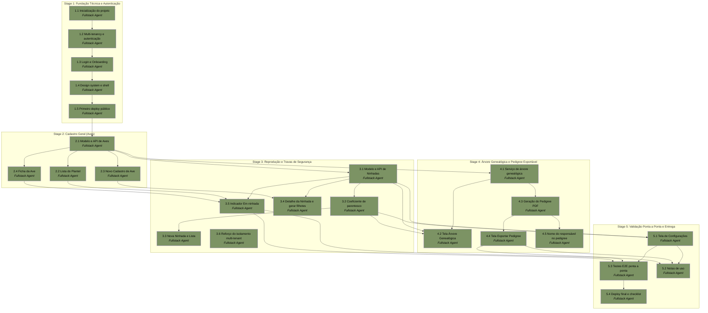

# APM Plan

## Workers

| Worker | Domain | Description |
|---|---|---|
| Fullstack Agent | Aplicação completa (frontend, backend, dados, testes, deploy) | Implementa todas as camadas da aplicação Next.js — modelo de dados/Prisma, APIs, telas de acordo com o design aprovado em `design/`, lógica de negócio (coeficiente de parentesco, cálculo de taxa de eclosão), testes automatizados e deploy em produção. |

## Stages

| Stage | Name | Tasks | Agents |
|---|---|---|---|
| 1 | Fundação Técnica e Autenticação | 5 | Fullstack Agent |
| 2 | Cadastro Geral (Aves) | 4 | Fullstack Agent |
| 3 | Reprodução e Travas de Segurança | 6 | Fullstack Agent |
| 4 | Árvore Genealógica e Pedigree Exportável | 5 | Fullstack Agent |
| 5 | Validação Ponta a Ponta e Entrega | 4 | Fullstack Agent |

## Dependency Graph

---

> **Notes:** Há um único Worker (Fullstack Agent) neste Plan, por decisão deliberada — o usuário confirmou durante o Context Gathering que desenvolvimento fullstack geral é suficiente para todo o escopo, sem necessidade de especialização por domínio. Isso significa que não há paralelismo entre Workers disponível: todo o despacho será sequencial (Tasks em lote para o mesmo agente). O caminho crítico é essencialmente o Plan inteiro, já que cada Stage depende da anterior. Pontos de convergência a observar: Task 3.5 depende de saídas de três Tasks anteriores (3.1, 2.2, 2.4); Task 4.2 depende de três Tasks (4.1, 3.1, 3.2); Tasks 5.2 e 5.3 dependem de múltiplas entregas finais de Stages 3 e 4 — esses são bons pontos para verificação holística antes de avançar. A Stage 1 termina com um primeiro deploy público deliberadamente cedo (Task 1.5), para que o critério de "aplicação publicamente acessível" comece a ser válido desde o início do projeto, não só no final.

## Stage 1: Fundação Técnica e Autenticação

### Task 1.1: Inicialização do projeto e infraestrutura base - Fullstack Agent

* **Objective:** Criar o esqueleto do projeto Next.js/TypeScript, inicializar o controle de versão, e conectar o Prisma ao Postgres gerenciado pelo Supabase.
* **Output:** Repositório git inicializado com o scaffold do Next.js (TypeScript); Prisma instalado e configurado com uma conexão válida ao banco Supabase; estrutura de pastas base do projeto.
* **Validation:** `npm run dev` inicia sem erros localmente; `prisma migrate` (ou equivalente) conecta e executa com sucesso contra o banco Supabase; existe um commit inicial no git.
* **Guidance:** Referenciar Spec §Arquitetura e Stack Técnica para as escolhas de stack (Next.js, TypeScript, Prisma, Supabase). O usuário já possui acesso à conta Supabase e autorizou a instalação de CLIs necessárias neste ambiente — solicitar as credenciais/string de conexão do projeto Supabase ao usuário como um passo de coordenação explícito.
* **Dependencies:** None.

1. Inicializar repositório git no workspace.
2. Criar o scaffold do projeto Next.js com TypeScript.
3. Solicitar ao usuário a criação/acesso ao projeto Supabase e a string de conexão Postgres.
4. Instalar e configurar o Prisma apontando para a conexão fornecida.
5. Verificar conectividade rodando uma migração inicial vazia.
6. Commitar o estado inicial do projeto.

### Task 1.2: Modelo multi-tenant e autenticação - Fullstack Agent

* **Objective:** Implementar o modelo de dados de Tenant/Usuário, integrar o Supabase Auth, e construir o middleware de isolamento de dados por tenant.
* **Output:** Schema Prisma com o modelo de Tenant e a relação que todas as tabelas de domínio usarão; integração funcional com Supabase Auth (cadastro, login, logout); middleware do Prisma que aplica automaticamente o filtro por tenant em consultas de tabelas tenant-scoped; testes automatizados do middleware.
* **Validation:** Testes automatizados demonstram que uma consulta sem contexto de tenant correto é bloqueada ou filtrada corretamente; fluxo manual de cadastro/login/logout funciona localmente.
* **Guidance:** Seguir exatamente a estratégia definida em Spec §Multi-tenancy e Isolamento de Dados — isolamento na camada de aplicação via middleware do Prisma, não Row-Level Security nativa.
* **Dependencies:** Task 1.1.

1. Modelar o Tenant no schema Prisma (referenciado por todas as tabelas de domínio futuras).
2. Integrar o SDK do Supabase Auth ao Next.js (cadastro, login, logout, sessão).
3. Implementar o middleware do Prisma que injeta e valida o filtro de tenant em toda consulta a tabelas tenant-scoped.
4. Escrever testes automatizados cobrindo acesso correto (mesma tenant) e acesso bloqueado (tenant diferente).

### Task 1.3: Telas de Login e Onboarding do criatório - Fullstack Agent

* **Objective:** Implementar as telas de Login e Onboarding, criando o perfil do criatório (tenant) durante o primeiro acesso.
* **Output:** Tela de Login/Cadastro funcional; fluxo de Onboarding que coleta nome do criatório, foco de criação e logo, e cria o registro de Tenant associado ao usuário.
* **Validation:** Um novo usuário consegue se cadastrar, completar o onboarding, e chegar a um Dashboard vazio; a aparência confere com o design.
* **Guidance:** Usar `design/01 Login.dc.html` e `design/02 Onboarding.dc.html` como referência direta de layout e conteúdo; paleta e tipografia vêm de `design/Design System.dc.html`.
* **Dependencies:** Task 1.2.

1. Implementar a tela de Login/Cadastro consumindo o Supabase Auth da Task 1.2.
2. Implementar o fluxo de Onboarding (nome do criatório, foco de criação, upload de logo).
3. Persistir os dados do criatório no modelo de Tenant ao concluir o onboarding.
4. Redirecionar para um Dashboard vazio ao final do fluxo.

### Task 1.4: Design system no código e shell de navegação - Fullstack Agent

* **Objective:** Extrair o design system aprovado para componentes de UI reutilizáveis e montar o shell de navegação (sidebar desktop / navegação inferior mobile).
* **Output:** Tema/configuração de estilo (cores, tipografia, espaçamento) e biblioteca de componentes base (botões, inputs, badges, cards, alertas) usados por todas as telas seguintes; shell de navegação funcional (tela 03, vazio de conteúdo de domínio).
* **Validation:** Componentes base batem visualmente com `design/Design System.dc.html`; navegação responde corretamente nos breakpoints mobile e desktop (comportamento visto em `design/10 Árvore Genealógica.dc.html` como referência de shell responsivo).
* **Guidance:** Fonte única de verdade visual é a pasta `design/` (per Spec §Workspace) — não inventar tokens de estilo fora do que está lá.
* **Dependencies:** Task 1.3.

1. Configurar fontes (Source Serif 4, Manrope, Space Grotesk) e paleta de cores como tema compartilhado.
2. Construir os componentes base reutilizáveis (botões, inputs, badges, cards, alertas, navegação).
3. Montar o shell de navegação responsivo (sidebar desktop / bottom nav mobile) conforme `design/03 Dashboard.dc.html`.

### Task 1.5: Primeiro deploy público - Fullstack Agent

* **Objective:** Publicar o esqueleto atual (autenticação, onboarding, dashboard vazio) em um ambiente de produção publicamente acessível.
* **Output:** Aplicação implantada na Vercel, conectada ao projeto Supabase de produção, acessível por URL pública.
* **Validation:** A URL pública carrega e o fluxo de cadastro/login/onboarding/dashboard vazio funciona em produção.
* **Guidance:** O usuário já possui acesso à conta Vercel e autorizou a instalação de CLIs necessárias — solicitar a vinculação do projeto Vercel como passo de coordenação explícito.
* **Dependencies:** Task 1.4.

1. Solicitar ao usuário a vinculação/criação do projeto Vercel.
2. Configurar variáveis de ambiente de produção (conexão Supabase).
3. Publicar o deploy inicial.
4. Verificar o fluxo completo (cadastro→onboarding→dashboard) na URL pública.

## Stage 2: Cadastro Geral (Aves)

### Task 2.1: Modelo de dados e API de Aves - Fullstack Agent

* **Objective:** Implementar o schema de dados e a API CRUD para o Cadastro Geral de aves.
* **Output:** Schema Prisma da entidade Ave (anilha, nome/apelido, espécie, mutação/cor, sexo, data de nascimento, origem, anilha_pai, anilha_mae, status, foto), tenant-scoped; endpoints de criação, listagem, detalhe e edição.
* **Validation:** Testes automatizados cobrindo: unicidade de `anilha` por tenant, campos obrigatórios, e a restrição de que `anilha_pai`/`anilha_mae` devem ser da mesma espécie e sexo compatível.
* **Guidance:** Seguir exatamente os campos e regras de Spec §Domínio e Modelo de Dados → Cadastro Geral (Aves), incluindo a lista gerenciável de espécies (não texto livre) e o enum de status (Ativo, Reservado, Vendido, Óbito, Fugiu — sem incluir "Em ninhada", que é calculado, não armazenado).
* **Dependencies:** Task 1.2.

1. Modelar a entidade Ave no schema Prisma, tenant-scoped.
2. Implementar os endpoints CRUD (criação, listagem, detalhe, edição).
3. Implementar a validação de unicidade de anilha por tenant.
4. Implementar a restrição de compatibilidade de espécie/sexo para `anilha_pai`/`anilha_mae`.
5. Escrever testes automatizados cobrindo as regras acima.

### Task 2.2: Tela Lista do Plantel - Fullstack Agent

* **Objective:** Implementar a listagem do plantel com busca e filtros.
* **Output:** Tela 04 funcional: lista de aves com busca por nome/anilha e filtros por espécie/status.
* **Validation:** Busca e filtros retornam resultados corretos contra dados de teste; layout confere com `design/04 Lista do Plantel.dc.html`.
* **Guidance:** Usar os componentes base da Task 1.4 (tabela/lista, badges de status).
* **Dependencies:** Task 2.1.

1. Implementar a consulta de listagem com suporte a busca e filtros no backend.
2. Construir a tela de listagem consumindo essa consulta.
3. Aplicar os badges de status conforme o design system.

### Task 2.3: Tela Novo Cadastro de Ave - Fullstack Agent

* **Objective:** Implementar o formulário de cadastro de uma nova ave.
* **Output:** Tela 06 funcional: formulário completo com upload de foto (Supabase Storage), seleção de espécie (lista fechada), campo de mutação/cor, seleção de pai/mãe filtrada por espécie e sexo compatível (com opção "Nenhum/desconhecido"), e toggle de origem (Nascida no criatório / Adquirida).
* **Validation:** Salvar uma ave nova persiste corretamente todos os campos; os dropdowns de pai/mãe só mostram aves da mesma espécie e sexo correto; upload de foto funciona e a imagem fica acessível depois.
* **Guidance:** Usar `design/06 Novo Cadastro de Ave.dc.html` como referência direta; o upload de foto vai para Supabase Storage per Spec §Arquitetura e Stack Técnica.
* **Dependencies:** Task 2.1.

1. Construir o formulário com todos os campos per Spec.
2. Implementar o upload de foto para Supabase Storage.
3. Implementar os dropdowns de pai/mãe filtrados dinamicamente por espécie/sexo.
4. Implementar o toggle de origem.
5. Ligar o formulário ao endpoint de criação da Task 2.1.

### Task 2.4: Tela Ficha da Ave - Fullstack Agent

* **Objective:** Implementar a visualização detalhada e edição de uma ave já cadastrada, incluindo mudança de status.
* **Output:** Tela 05 funcional: exibição completa dos dados da ave, edição de campos, e ação de mudança de status (Ativo/Reservado/Vendido/Óbito/Fugiu).
* **Validation:** Edições persistem corretamente; mudança de status reflete imediatamente na Ficha e na Lista do Plantel.
* **Guidance:** Usar `design/05 Ficha da Ave.dc.html` como referência. O indicador "Em ninhada" **não** é implementado nesta Task — depende do modelo de Ninhada, que ainda não existe (ver Task 3.5).
* **Dependencies:** Task 2.1.

1. Construir a tela de detalhe consumindo o endpoint de detalhe da Task 2.1.
2. Implementar a edição de campos.
3. Implementar a ação de mudança de status.

## Stage 3: Reprodução e Travas de Segurança

### Task 3.1: Modelo de dados e API de Ninhadas - Fullstack Agent

* **Objective:** Implementar o schema de dados e a API CRUD para Ninhadas, incluindo a geração automática do código e o cálculo da taxa de eclosão.
* **Output:** Schema Prisma da entidade Ninhada (cod_ninhada, anilha_macho, anilha_femea, data_postura, ovos_previstos, ovos_botados, ovos_ferteis, filhotes_nascidos, taxa_eclosao), tenant-scoped; geração automática de `cod_ninhada` no formato `AAAA-NN` (sequência por tenant/ano); endpoints CRUD com suporte a preenchimento progressivo (campos nullable).
* **Validation:** Testes automatizados cobrindo: geração e unicidade sequencial do `cod_ninhada` por tenant/ano; cálculo correto de `taxa_eclosao` incluindo o caso de divisão por zero/campos ausentes.
* **Guidance:** Seguir Spec §Domínio e Modelo de Dados → Reprodução (Ninhadas). `anilha_macho`/`anilha_femea` devem respeitar a mesma espécie e Status = Ativo (Trava 1) — reutilizar/estender a validação de compatibilidade já construída na Task 2.1.
* **Dependencies:** Task 2.1.

1. Modelar a entidade Ninhada no schema Prisma, tenant-scoped.
2. Implementar a geração automática do `cod_ninhada` (ano + sequência por tenant).
3. Implementar os endpoints CRUD com suporte a preenchimento progressivo.
4. Implementar o cálculo de `taxa_eclosao` com guarda contra divisão por zero.
5. Implementar a Trava 1 (restrição de espécie/sexo/status na seleção do casal).
6. Escrever testes automatizados cobrindo os pontos acima.

### Task 3.2: Coeficiente de parentesco e alerta de consanguinidade - Fullstack Agent

* **Objective:** Implementar o cálculo do coeficiente de parentesco entre dois indivíduos e expor essa lógica como função reutilizável pela UI.
* **Output:** Função/serviço que recebe duas anilhas e retorna o coeficiente de parentesco (25% / 12,5% / 6,25% / 0%) conforme a tabela de Spec §Trava 2, usando os dados de 3 gerações disponíveis; leitura de uma preferência de tenant "alertas de consanguinidade ativados" (default: ativado), que será exposta na tela de Configurações (Task 5.1).
* **Validation:** Testes automatizados cobrindo cada caso da tabela de Spec §Trava 2: pai/mãe-filho direto, irmãos completos, meio-irmãos, avô/avó-neto, avô/avó em comum único, e nenhum parentesco — cada um deve retornar o percentual correto.
* **Guidance:** Método de contagem de caminhos genealógicos assumindo ancestrais desconhecidos como não-aparentados, per Spec §Trava 2. Esta é a peça de maior risco técnico identificada no Spec — priorizar cobertura de teste completa antes de integrar à UI.
* **Dependencies:** Task 3.1, Task 2.1.

1. Implementar a função de cálculo do coeficiente de parentesco usando os dados de ancestralidade de 3 gerações.
2. Implementar a leitura da preferência de tenant "alertas de consanguinidade ativados" com valor padrão.
3. Escrever a matriz completa de testes automatizados cobrindo todos os casos de relação da tabela do Spec.

### Task 3.3: Telas Nova Ninhada e Lista de Ninhadas - Fullstack Agent

* **Objective:** Implementar a criação de ninhadas com a Trava 1 e o alerta de consanguinidade em tempo real, e a listagem de ninhadas.
* **Output:** Tela 08 funcional: seleção de espécie, macho e fêmea (restritos pela Trava 1), exibição em tempo real do alerta de consanguinidade com o coeficiente calculado (ou confirmação de "nenhum parentesco direto"); tela 07 funcional: listagem de ninhadas.
* **Validation:** Selecionar um casal com parentesco conhecido exibe o alerta com o percentual correto; selecionar um casal sem parentesco exibe a confirmação de segurança; o alerta não bloqueia a confirmação da ninhada (per Spec, é apenas informativo).
* **Guidance:** Usar `design/08 Nova Ninhada.dc.html` e `design/07 Lista de Ninhadas.dc.html` como referência; a lógica de exibição do alerta segue o padrão `showRisk`/`showSafe` já prototipado no design.
* **Dependencies:** Task 3.2.

1. Construir o formulário de Nova Ninhada com os selects restritos pela Trava 1.
2. Integrar o cálculo de coeficiente da Task 3.2 em tempo real na seleção do casal.
3. Implementar a exibição condicional do alerta de risco ou da confirmação de segurança.
4. Construir a tela de Lista de Ninhadas.

### Task 3.4: Tela Detalhe da Ninhada e fluxo "gerar filhotes" - Fullstack Agent

* **Objective:** Implementar a visualização/edição progressiva de uma ninhada e o atalho para pré-cadastrar os filhotes.
* **Output:** Tela 09 funcional: preenchimento progressivo de ovos_botados/ovos_ferteis/filhotes_nascidos, exibição da taxa de eclosão; ação "gerar filhotes" que abre o formulário de Novo Cadastro de Ave (Task 2.3) com os campos de pai/mãe pré-preenchidos com o casal da ninhada.
* **Validation:** Atualizar os campos progressivos recalcula a taxa de eclosão corretamente; a ação "gerar filhotes" abre o cadastro de ave com pai/mãe já selecionados.
* **Guidance:** Usar `design/09 Detalhe da Ninhada.dc.html` como referência.
* **Dependencies:** Task 3.1, Task 2.3.

1. Construir a tela de detalhe com os campos progressivos e a taxa de eclosão calculada.
2. Implementar a ação "gerar filhotes" com pré-preenchimento do formulário de cadastro de ave.

### Task 3.5: Indicador "Em ninhada" retroativo no Cadastro Geral - Fullstack Agent

* **Objective:** Adicionar o indicador calculado "Em ninhada" às telas de Lista do Plantel e Ficha da Ave, agora que o modelo de Ninhada existe.
* **Output:** Badge "Em ninhada" exibido nas telas 04 e 05 quando a ave está referenciada em uma Ninhada em andamento, sem alterar o campo `status` armazenado.
* **Validation:** Uma ave referenciada em uma ninhada em andamento exibe o badge "Em ninhada" em ambas as telas; o campo `status` armazenado permanece inalterado.
* **Guidance:** Per Spec §Domínio e Modelo de Dados → Reprodução — este indicador é puramente de exibição, calculado a partir da existência de uma Ninhada em andamento referenciando a ave.
* **Dependencies:** Task 3.1, Task 2.2, Task 2.4.

1. Implementar a consulta que determina se uma ave está referenciada em uma Ninhada em andamento.
2. Adicionar o badge calculado à Lista do Plantel e à Ficha da Ave.

### Task 3.6: Reforço estrutural do isolamento multi-tenant - Fullstack Agent

* **Objective:** Tornar o padrão de isolamento por tenant (`runWithTenant`/middleware do Prisma, Task 1.2) estruturalmente mais resistente ao esquecimento de `await` interno, que já causou duas falhas (sempre seguras — erro, sem vazamento de dado) em código de produção (Task 2.1) e de teste (Task 3.5).
* **Output:** Uma salvaguarda estrutural (wrapper, assinatura de função revisada, ou regra de lint customizada) que torna o padrão incorreto mais difícil de escrever silenciosamente, mantendo o comportamento correto já existente; teste automatizado que comprova que a salvaguarda de fato pega o padrão incorreto.
* **Validation:** Um teste automatizado que reproduz deliberadamente o padrão incorreto (callback sem `await` interno) demonstra que a salvaguarda o detecta (erro claro e imediato, ou falha de lint/build) em vez de depender apenas da disciplina do desenvolvedor; a suíte de testes existente continua passando sem alteração de comportamento para o uso correto do padrão.
* **Guidance:** Investigar a causa raiz exata antes de propor a correção — o achado registrado descreve que o despacho da consulta ocorre fora da janela síncrona de `AsyncLocalStorage.run()` quando o callback não é aguardado internamente. Avaliar a opção mais simples e idiomática (ex: revisar a assinatura de `runWithTenant` para aceitar apenas callbacks que o próprio wrapper aguarda internamente, ou um lint customizado que sinaliza chamadas ao Prisma sem `await` dentro de callbacks de `runWithTenant`) em vez de introduzir complexidade desnecessária. Não é necessário reescrever chamadas já corretas existentes.
* **Dependencies:** None (Task independente, atua sobre a infraestrutura já existente da Task 1.2).

1. Investigar e confirmar a causa raiz exata do comportamento (propagação de `AsyncLocalStorage` através de callbacks não aguardados).
2. Implementar a salvaguarda estrutural escolhida.
3. Escrever um teste automatizado que reproduz deliberadamente o padrão incorreto e comprova que a salvaguarda o detecta.
4. Confirmar que a suíte de testes existente continua passando sem alteração de comportamento.

## Stage 4: Árvore Genealógica e Pedigree Exportável

### Task 4.1: Serviço de construção da árvore genealógica - Fullstack Agent

* **Objective:** Implementar a lógica de montagem dos dados de árvore genealógica de 3 gerações para uma ave.
* **Output:** Função/serviço que recebe uma anilha e retorna a estrutura de 3 gerações (ave, pais, avós), rotulando ancestrais ausentes como "Não registrado/a" ou "Adquirido/a — sem registro" conforme o campo `origem` do ancestral mais próximo conhecido.
* **Validation:** Testes automatizados cobrindo: árvore completa (todos os ancestrais conhecidos), árvore parcial (alguns ancestrais desconhecidos), e o caso de ancestral "Adquirida" gerando a rotulagem correta para os avós correspondentes.
* **Guidance:** Per Spec §Árvore Genealógica; reutiliza as referências `anilha_pai`/`anilha_mae` do modelo de Ave (Task 2.1) — não requer tabela de relacionamento separada.
* **Dependencies:** Task 2.1.

1. Implementar a consulta que busca os dados de pais e avós a partir das referências de parentesco da Ave.
2. Implementar a rotulagem de ancestrais ausentes conforme a regra de `origem`.
3. Escrever os testes cobrindo os casos acima.

### Task 4.2: Tela Árvore Genealógica - Fullstack Agent

* **Objective:** Implementar a visualização navegável da árvore genealógica.
* **Output:** Tela 10 funcional: exibição da ave consultada com pais e avós, navegação por clique (recentraliza a árvore no indivíduo clicado), e banner de ninhada ativa com o coeficiente de parentesco quando aplicável (per o exemplo do design: "cruzamento com o próprio pai").
* **Validation:** Clicar em um nó da árvore recentraliza corretamente; o banner de ninhada ativa aparece apenas quando há uma Ninhada em andamento envolvendo a ave consultada e um parente próximo, exibindo o coeficiente correto.
* **Guidance:** Usar `design/10 Árvore Genealógica.dc.html` como referência direta.
* **Dependencies:** Task 4.1, Task 3.1, Task 3.2.

1. Construir a visualização da árvore consumindo o serviço da Task 4.1.
2. Implementar a navegação por clique com recentralização.
3. Implementar o banner de ninhada ativa reutilizando o cálculo de coeficiente da Task 3.2.

### Task 4.3: Geração do Pedigree em PDF - Fullstack Agent

* **Objective:** Implementar a geração do certificado de pedigree em PDF.
* **Output:** Template `@react-pdf/renderer` reproduzindo o certificado (tela 11): dados da ave, foto, pais, avós (com rotulagem de ausência), identidade do criatório, responsável, e código de verificação cosmético.
* **Validation:** Teste automatizado estrutural confirmando que o PDF gerado contém todas as seções esperadas (ave, pais, avós, criatório, código de verificação) para um conjunto de dados de teste.
* **Guidance:** Usar `design/11 Exportar Pedigree.dc.html` como referência visual exata do certificado. Per Spec, o código de verificação não requer endpoint de consulta — é apenas exibido no documento.
* **Dependencies:** Task 4.1.

1. Implementar o template de PDF reproduzindo o layout do certificado.
2. Implementar a geração do código de verificação cosmético.
3. Escrever o teste estrutural do conteúdo do PDF gerado.

### Task 4.4: Tela Exportar Pedigree - Fullstack Agent

* **Objective:** Implementar a interface de exportação/compartilhamento do pedigree.
* **Output:** Tela 11 funcional com as ações "Exportar PDF", "Imagem" e "Compartilhar", consumindo o gerador da Task 4.3.
* **Validation:** Acionar "Exportar PDF" produz o arquivo esperado para download.
* **Guidance:** Usar `design/11 Exportar Pedigree.dc.html` como referência.
* **Dependencies:** Task 4.3.

1. Construir a tela com as ações de exportação.
2. Ligar a ação "Exportar PDF" ao gerador da Task 4.3.

### Task 4.5: Persistir nome do responsável e corrigir o pedigree - Fullstack Agent

* **Objective:** Persistir o nome completo do responsável, coletado no formulário de cadastro desde a Task 1.3, e atualizar o gerador de pedigree (Task 4.3) para usá-lo em vez do e-mail do usuário.
* **Output:** Nome completo persistido em algum lugar acessível sem consulta extra por requisição (ex: `user_metadata` do Supabase Auth, atualizado durante o cadastro); `lib/pedigree/service.ts` (`montarDadosPedigree`) atualizado para ler esse nome real, com fallback para o e-mail apenas quando o nome não estiver disponível (contas criadas antes desta correção).
* **Validation:** Testes automatizados confirmando que o nome do responsável é persistido no cadastro e que o serviço de pedigree o usa quando disponível, com fallback correto para o e-mail em contas sem esse dado.
* **Guidance:** Esta Task corrige uma deficiência descoberta na Task 4.3: o campo "Nome completo" já existe no formulário de cadastro (Task 1.3) mas nunca foi persistido — nem no Supabase Auth nem no `Tenant`. Referenciar `lib/auth/actions.ts` (`signUpAction`, Task 1.2/1.3) para o ponto de persistência; a Task 1.3 original permanece concluída, esta Task apenas fecha a lacuna. Preferir persistir via `user_metadata` do Supabase Auth (já disponível na sessão/JWT sem round-trip extra) sobre um campo novo no `Tenant`, a menos que a investigação mostre uma razão concreta para a segunda opção.
* **Dependencies:** Task 4.3.

1. Investigar o ponto exato onde o nome completo é coletado no cadastro e por que não é persistido atualmente.
2. Implementar a persistência do nome do responsável no cadastro.
3. Atualizar `montarDadosPedigree` para usar o nome real, com fallback para o e-mail quando ausente.
4. Escrever testes automatizados cobrindo a persistência e o fallback.

## Stage 5: Validação Ponta a Ponta e Entrega

### Task 5.1: Tela de Configurações - Fullstack Agent

* **Objective:** Implementar a tela de configurações da conta e do criatório.
* **Output:** Tela 12 funcional: edição de perfil, dados do criatório (nome, logo, foco de criação), toggle de "alertas de consanguinidade" (liga/desliga a preferência lida pela Task 3.2), toggle de notificações por e-mail (placeholder, sem envio real neste MVP), e logout.
* **Validation:** Alterar o toggle de alertas de consanguinidade persiste a preferência e afeta o comportamento da Task 3.2 na próxima consulta.
* **Guidance:** Usar `design/12 Configurações.dc.html` como referência.
* **Dependencies:** Task 1.3, Task 3.2.

1. Construir a tela de edição de perfil e dados do criatório.
2. Implementar o toggle de alertas de consanguinidade ligado à preferência da Task 3.2.
3. Implementar o botão de logout.

### Task 5.2: Notas de uso - Fullstack Agent

* **Objective:** Escrever a documentação de uso do produto para o usuário final.
* **Output:** Documento de notas de uso cobrindo o fluxo completo: cadastro/onboarding, cadastro de aves, criação de ninhadas (incluindo as travas), consulta da árvore genealógica, e exportação do pedigree.
* **Validation:** Revisão manual confirma que o documento cobre todas as funcionalidades do MVP de forma compreensível para um usuário final não técnico.
* **Guidance:** Escrever em português, direcionado ao criador de aves final (não um documento técnico de desenvolvimento).
* **Dependencies:** Task 4.4, Task 3.5, Task 5.1.

1. Documentar o fluxo de cadastro/onboarding.
2. Documentar o cadastro de aves e a Lista do Plantel.
3. Documentar a criação de ninhadas, incluindo as duas travas de segurança.
4. Documentar a consulta da árvore genealógica e a exportação do pedigree.

### Task 5.3: Testes E2E ponta a ponta - Fullstack Agent

* **Objective:** Implementar a suíte de testes end-to-end cobrindo o fluxo completo do MVP contra o ambiente publicado.
* **Output:** Suíte Playwright cobrindo: cadastro/login → onboarding → cadastro de ave → criação de ninhada (exercitando Trava 1 e Trava 2) → consulta da árvore genealógica → exportação do pedigree.
* **Validation:** A suíte passa integralmente ao ser executada contra a URL de produção.
* **Guidance:** Per Spec §Arquitetura e Stack Técnica — Playwright é a ferramenta escolhida para os testes ponta a ponta.
* **Dependencies:** Task 4.4, Task 3.5, Task 5.1.

1. Escrever o teste E2E do fluxo de cadastro/login/onboarding.
2. Escrever o teste E2E de cadastro de ave.
3. Escrever o teste E2E de criação de ninhada, incluindo casos que disparam a Trava 1 e a Trava 2.
4. Escrever o teste E2E de consulta da árvore e exportação do pedigree.
5. Executar a suíte completa contra o ambiente de produção.

### Task 5.4: Deploy final e checklist de aceite - Fullstack Agent

* **Objective:** Publicar a versão completa do MVP em produção e preparar o estado da aplicação para a revisão externa de aceite.
* **Output:** Deploy de produção atualizado com o conjunto completo de funcionalidades; checklist de aceite preenchido confirmando que cada item do escopo do MVP (Spec §Escopo do MVP) está funcional na URL pública.
* **Validation:** A URL pública reflete o conjunto completo de funcionalidades; o checklist de aceite está preenchido e disponível para a revisão externa.
* **Guidance:** A revisão externa em si (per Spec, nota do Planner) é um gate de aceite holístico coordenado pelo Manager no momento apropriado — esta Task prepara o terreno, não realiza a revisão.
* **Dependencies:** Task 5.3.

1. Publicar o deploy final com o conjunto completo de funcionalidades.
2. Verificar manualmente cada item do escopo do MVP na URL pública.
3. Preencher o checklist de aceite para a revisão externa.
